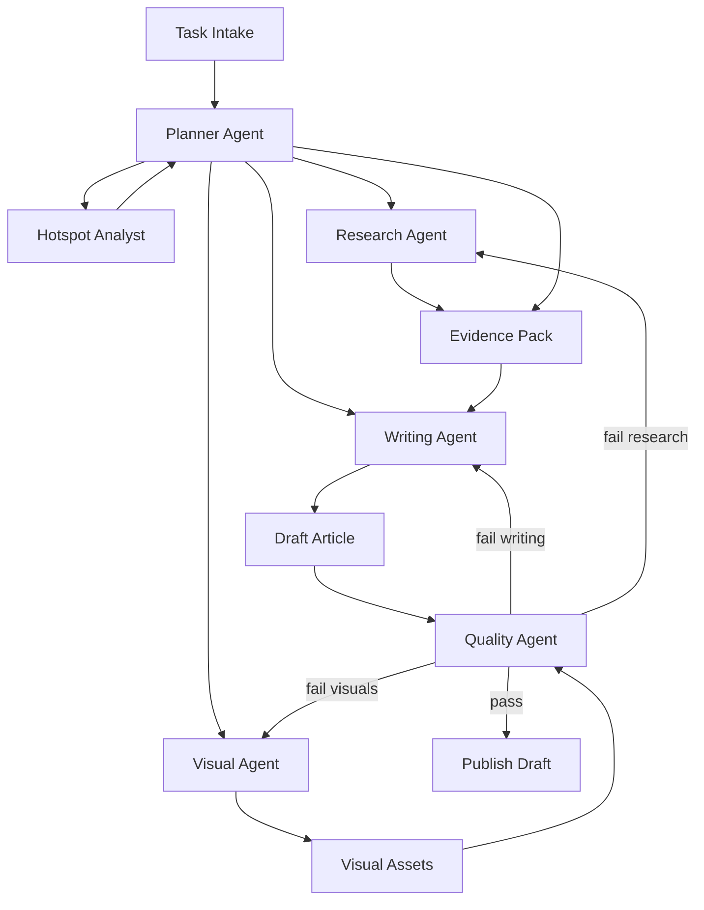
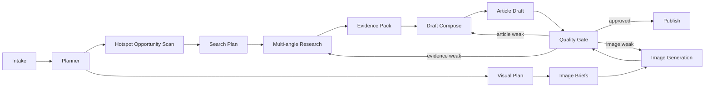
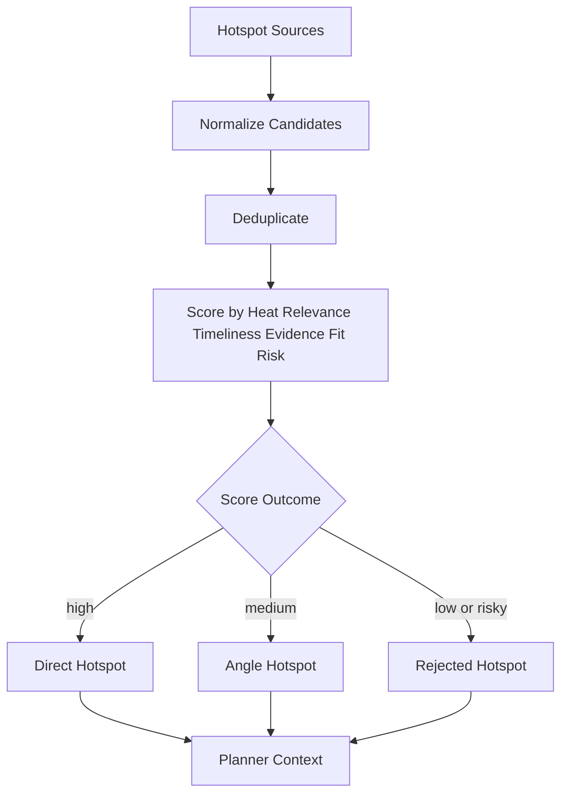
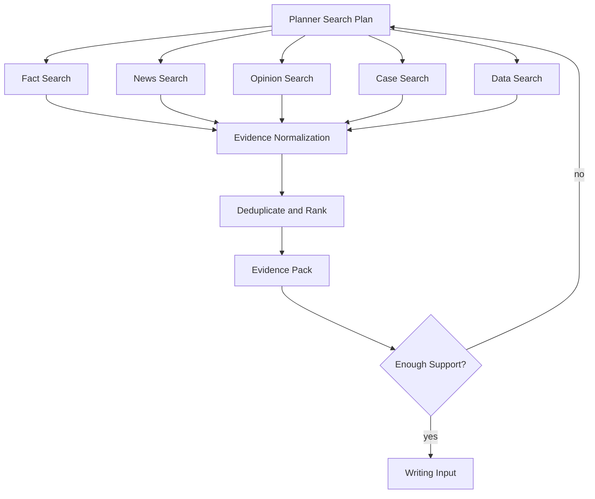
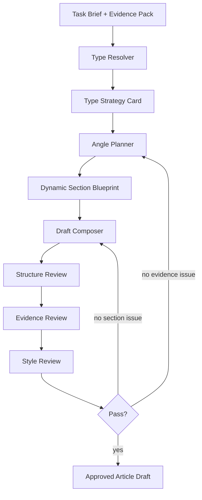
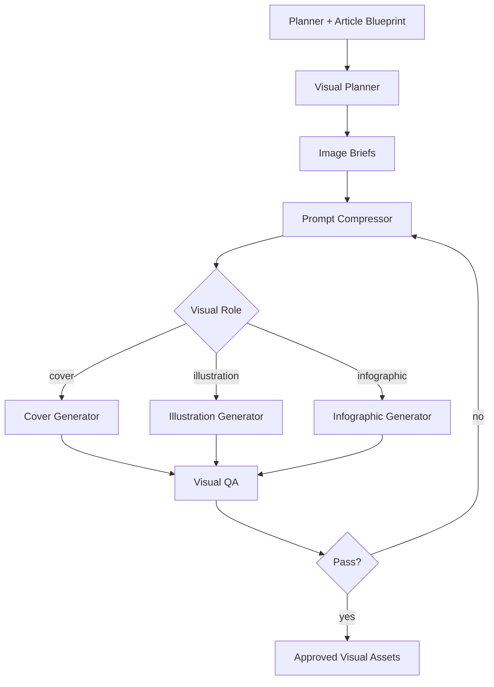
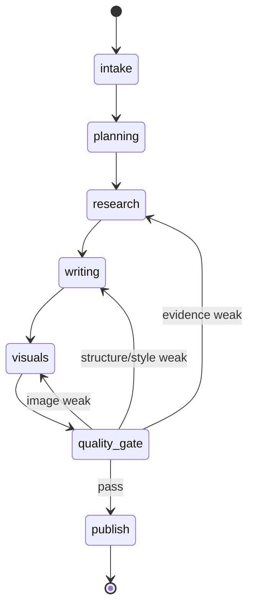

# 2026-04-13 Agent Redesign Design

## Summary

This spec redesigns the current article workflow from a linear `hotspot -> search -> article -> image` pipeline into a planner-orchestrated content factory for WeChat article production.

Target outcome:

- improve article quality first, with hotspot relevance as amplification
- formally support multiple article types in one system
- upgrade hotspot capture and search into multi-source, multi-angle research
- make images part of the content asset, not an afterthought
- keep LangGraph as orchestration infrastructure while replacing core stages

## Goals

- Replace single-pass article generation with planning, research, drafting, review, and targeted revision loops
- Replace fixed article templates with type strategies plus per-task dynamic blueprints
- Introduce multi-source hotspot discovery and multi-angle search planning
- Redesign image generation around role-specific briefs, size strategy, and quality review
- Produce structured planning, evidence, visual, and quality artifacts per task

## Non-Goals

- Rebuild task creation, scheduler, websocket progress, or draft publishing from scratch
- Introduce open-ended conversational agents for end users
- Optimize for lowest token cost or shortest latency in v1
- Build frontend redesign in this spec

## Current Problems

1. Article generation is still centered on large prompts and fixed blueprint assumptions, so quality degrades when topic, evidence shape, or article type changes.
2. Hotspot capture is a front-loaded helper, not a continuous planning input.
3. Search is too flat and does not separate fact, news, opinion, case, and data evidence.
4. Image generation treats cover and illustrations similarly, uses long prompts, and fixes size too early.
5. The workflow state is optimized for a linear pipeline instead of multi-stage agent collaboration and localized retry.

## Design Principles

- Quality before virality: articles must be readable, credible, and publishable before chasing trend amplification.
- Structured agents over free-form agents: each agent owns a bounded responsibility and writes a well-defined state slice.
- Dynamic blueprints over rigid templates: article type provides constraints, while each task gets a custom execution plan.
- Localized revision over full rerun: retry only the failed stage or weak section.
- Asset-first output: the system produces an article package, not just markdown text.

## Proposed Architecture

The new system becomes a planner-led orchestration with specialist agents and explicit quality gates.

### Core Layers

1. Intake Layer
   Collects topic, account positioning, generation config, hotspot settings, image expectations, and runtime profile.
2. Planner Layer
   Resolves article type, angle, hotspot opportunity, search plan, evidence needs, and visual plan.
3. Specialist Agent Layer
   Includes hotspot analysis, research, writing, visual planning/generation, and quality review.
4. Strategy Layer
   Holds article-type strategy cards and visual role strategy cards.
5. Quality Gate Layer
   Scores article structure, evidence support, hotspot integration, title quality, and image fit.
6. Publishing Layer
   Persists final article, images, quality report, and generation trace.

### System Diagram

## End-to-End Runtime Flow

The new runtime is explicitly staged and supports feedback loops.

### Main Flow

1. Intake builds a normalized task brief.
2. Planner classifies article type and produces an execution blueprint.
3. Hotspot Analyst gathers and scores multi-source hotspot opportunities.
4. Research Agent runs multi-angle search and builds an evidence pack.
5. Writing Agent drafts the article from the type strategy and evidence pack.
6. Visual Agent creates image briefs and generates assets by role.
7. Quality Agent scores the full package and either passes or routes to targeted revision.
8. Publishing persists the content package and progress trace.

### Runtime Flowchart

## Multi-Source Hotspot Design

Hotspots should no longer be a single-source preprocessor. They become a scored planning input.

### Hotspot Sources

- ranking platforms: Weibo, Zhihu, Baidu, Toutiao, WeChat ecosystem sources when available
- media/news feeds: reputable tech, business, policy, and finance media
- industry signals: reports, launches, earnings, policy updates, benchmark releases
- internal content history: previously high-performing topics, title patterns, durable angles

### Hotspot Outputs

The hotspot layer should produce:

- `direct_hotspots`: can be used as the main topic
- `angle_hotspots`: useful as an opening hook or comparison angle
- `rejected_hotspots`: high heat but poor fit, low credibility, or weak depth

### Hotspot Scoring Dimensions

- raw heat
- topic relevance
- timeliness
- evidence density
- expansion potential
- account-fit
- risk level

### Hotspot Flowchart

## Multi-Angle Research Design

Search must be organized by evidence purpose instead of a single query list.

### Research Angles

- fact: official announcements, documentation, filings, policy text, papers
- news: recent events, coverage, interviews, time-sensitive updates
- opinion: expert commentary, controversy, interpretation, community discussion
- case: company, product, person, implementation, market examples
- data: statistics, charts, benchmarks, time-series data

### Research Outputs

Research Agent should build a normalized evidence pack, not just raw extracted pages.

- `confirmed_facts`
- `caution_items`
- `usable_data_points`
- `usable_cases`
- `risk_points`
- `actionable_takeaways`
- `research_gaps`

### Research Flowchart

## Article Agent Redesign

The current `generate_article` node should be replaced by a staged article agent.

### Article Stages

1. Type Resolver
   Determines article type from topic, hotspot shape, evidence density, audience, and publishing goal.
2. Angle Planner
   Defines core thesis, reader payoff, title direction, opening hook, section goals, evidence slots, and visual anchor points.
3. Draft Composer
   Writes the first draft from type strategy, dynamic blueprint, and evidence pack.
4. Revision Loop
   Performs structure review, evidence review, and style review, then selectively rewrites weak parts.

### Type Support Model

V1 should formally support multiple article types through strategy cards instead of giant custom prompts.

Example types:

- quick news
- hotspot interpretation
- trend analysis
- case breakdown
- listicle/roundup
- opinion piece
- tutorial/how-to
- product review

### Strategy Card Structure

Each article type should declare:

- `type_id`
- `activation_signals`
- `recommended_section_shapes`
- `evidence_mix`
- `title_style`
- `visual_preferences`
- `quality_rules`
- `forbidden_patterns`

### Article Generation Flowchart

## Template Strategy

Templates should move from fixed output molds to layered constraints.

### Layer 1: Global Writing Rules

- answer the topic clearly
- avoid empty abstractions and generic filler
- every section must have a purpose
- claims require visible support
- uncertainty must be labeled as uncertainty

### Layer 2: Type Strategy

Each type defines structure and evidence expectations, but not literal wording.

### Layer 3: Task Blueprint

Each run builds a task-specific section plan:

- exact sections
- section goals
- evidence placement
- hotspot insertion points
- illustration anchors
- risk and action sections when needed

## Visual System Redesign

The image system should become a role-aware visual asset pipeline.

### Visual Stages

1. Visual Planner
   Defines image purpose, role, target paragraph/position, style direction, and size strategy.
2. Prompt Compressor
   Converts article context into a concise visual brief instead of passing long text.
3. Role-Specific Image Generator
   Applies different logic for cover, supporting illustration, infographic, comparison chart, and concept diagram.
4. Visual QA
   Scores match, clarity, composition, text/noise problems, and crop suitability.

### Visual Roles

- cover image
- contextual illustration
- infographic
- comparison graphic
- concept diagram

### Size Strategy

The system should store:

- `target_aspect_ratio`
- `target_usage`
- `provider_size`
- optional post-processing instructions

Business presets should include:

- WeChat cover
- in-article landscape image
- in-article portrait image
- long infographic
- square social card

### Visual Flowchart

## Quality Gate Design

Quality is a first-class stage, not a side effect of a good prompt.

### Quality Dimensions

- article structure quality
- evidence sufficiency
- hotspot integration quality
- title quality
- visual relevance and clarity
- publish readiness

### Gate Outcomes

- `pass`
- `revise_writing`
- `revise_research`
- `revise_visuals`
- `degrade_and_publish`
- `fail_task`

## Data Model Redesign

The workflow state should be reorganized around production artifacts.

### Proposed State Blocks

1. `task_brief`
   topic, original topic, audience, account profile, generation config, image config, hotspot config
2. `planning_state`
   type decision, angle decision, title strategy, section blueprint, search plan, visual plan, quality thresholds
3. `research_state`
   hotspot candidates, hotspot decision, raw search outputs, extracted evidence, evidence pack, gaps
4. `writing_state`
   draft versions, title candidates, summary candidates, rewrite history, style review results
5. `visual_state`
   image briefs, model decisions, size plans, generated assets, retry history, QA results
6. `quality_state`
   scores, findings, revision decisions, final release recommendation

### Example State Transition

## LangGraph Migration Strategy

Keep LangGraph as the orchestration skeleton, but replace the middle of the graph.

### Current Critical Nodes

- `capture_hot_topics`
- `interpret_user_intent`
- `infer_style_profile`
- `build_article_blueprint`
- `plan_search_queries`
- `search_web`
- `fetch_extract`
- `generate_article`
- `generate_images`

### Target Stage Graph

- `intake_task_brief`
- `planner_agent`
- `analyze_hotspot_opportunities`
- `plan_research`
- `run_research`
- `build_evidence_pack`
- `resolve_article_type`
- `plan_article_angle`
- `compose_draft`
- `plan_visual_assets`
- `generate_visual_assets`
- `quality_gate`
- `targeted_revision`
- `push_to_draft`

### Migration Phases

1. Preserve infrastructure
   Keep task APIs, scheduler, draft publishing, logs, and progress streaming.
2. Replace planning and article core
   Introduce planner state, type strategies, draft/review loop.
3. Replace visual core
   Introduce visual briefs, role-aware generation, and visual QA.
4. Expand hotspot and research
   Upgrade from single-source hotspot + flat search into multi-source, multi-angle research.

## Failure Handling

The system should distinguish failure types.

### Failure Classes

- retryable failure
  rate limits, timeouts, transient provider failures
- degradable failure
  one source unavailable, one image type failed, hotspot source unavailable
- content-quality failure
  weak structure, weak evidence, weak hotspot connection, weak visuals
- unrecoverable failure
  missing configuration, invalid task brief, publish pipeline unavailable

### Required Failure Fields

- `stage_name`
- `failure_type`
- `failure_reason`
- `retry_count`
- `next_action`

## Evaluation and Acceptance

### Per-Task Evaluation

- content quality
- hotspot relevance
- evidence credibility
- image asset quality
- publish readiness

### Acceptance Criteria for V1

1. Multiple article types run through formal strategy-driven generation paths.
2. Hotspot discovery and research support multiple sources and multiple evidence angles.
3. Article generation is staged into planning, drafting, review, and targeted revision.
4. Image generation supports role-based briefs and size strategy instead of one fixed prompt and one fixed size.
5. Every task outputs structured planning, evidence, visual, and quality artifacts.

## Implementation Direction

Recommended implementation order:

1. redesign workflow state and planner agent
2. redesign article type strategy and article revision loop
3. redesign visual planning and generation
4. expand hotspot discovery and multi-angle research
5. add quality scoring, targeted revision, and observability

This order reduces risk because planner and state are prerequisites for every later change.

## Risks

- formal support for many article types in v1 increases design and testing complexity
- higher quality loops will increase latency and token usage
- multi-source hotspot and research integration will require provider abstraction and fallback strategy
- image quality still depends on model capability, so role-aware prompts alone will not solve all issues

## Open Decision Already Resolved

These decisions were agreed during brainstorming:

- operating mode: fully automated batch production
- priority order: content quality first, hotspot relevance second
- scope: formal support for multiple article types in v1
- cost profile: quality-first, higher latency and token usage acceptable
- image role: part of the final content asset, not just a decorative add-on

## Next Step

After review approval, create an implementation plan that breaks the redesign into staged repository changes while preserving current production stability.

## Implementation Status

- Status: Core planner-led workflow stages implemented in branch `feature/agent-redesign-spec`
- Verified by: `pytest -v`
