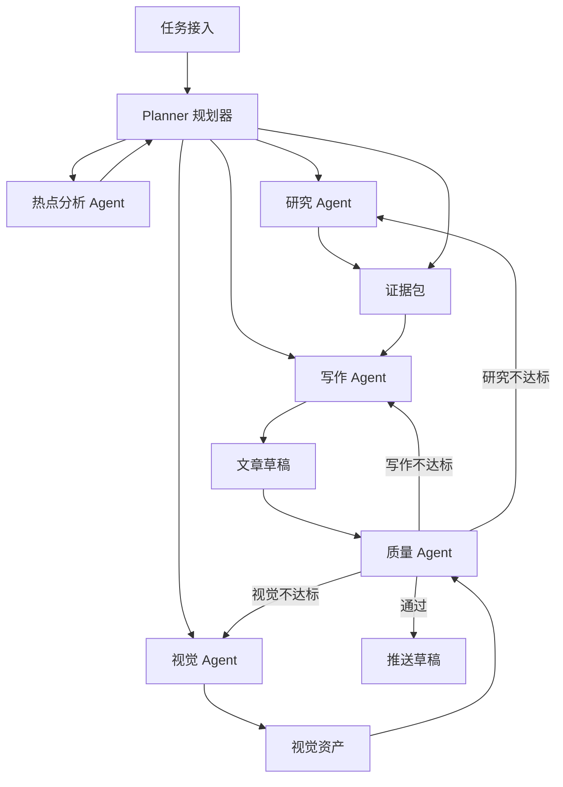
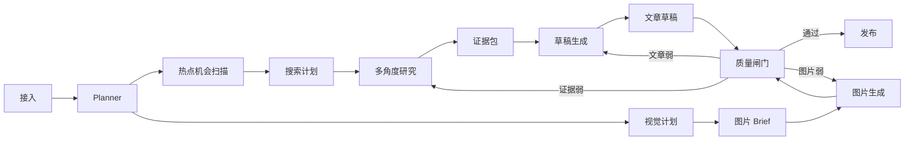
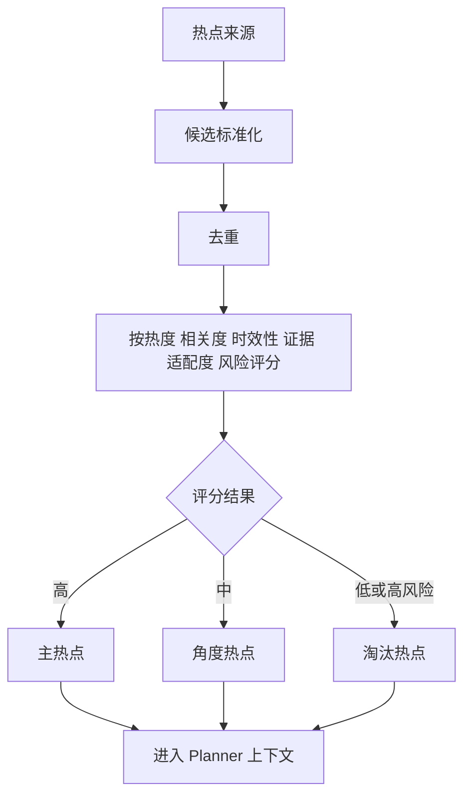
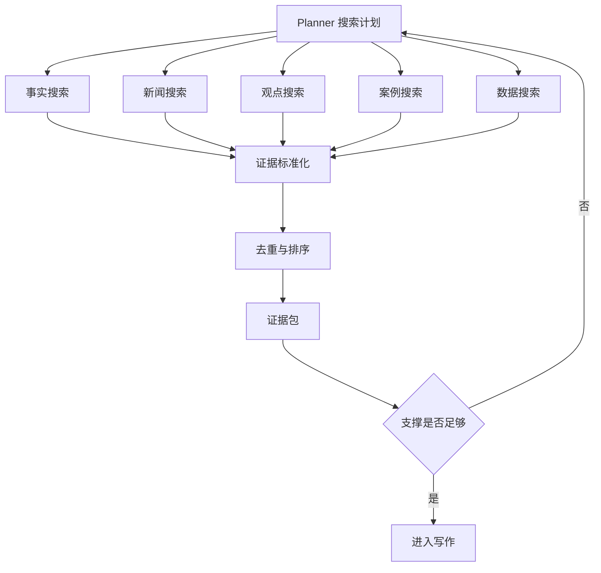
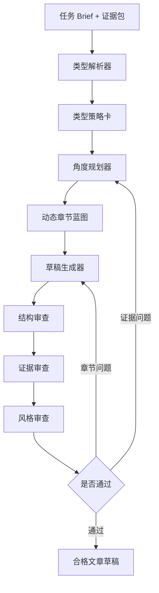
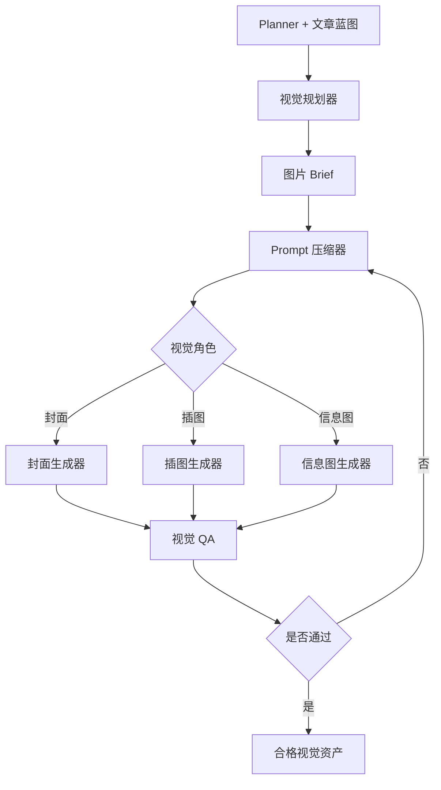
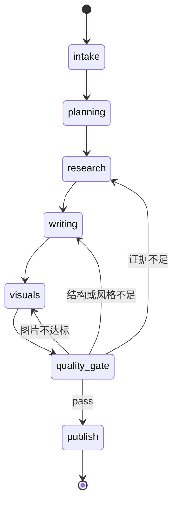

# 2026-04-13 Agent 重构设计方案

## 概述

本文档用于将当前公众号文章生产流程，从线性的 `热点 -> 搜索 -> 文章 -> 图片` 流水线，重构为一个由规划器驱动的内容生产工厂。

目标结果：

- 先提升文章质量，再用热点提升传播性
- 在同一套系统中正式支持多种文章类型
- 将热点获取与搜索升级为多源、多角度研究系统
- 让图片成为内容资产的一部分，而不是后补装饰
- 保留 LangGraph 作为编排基础设施，但替换中间核心阶段

## 目标

- 将单次文章生成改为规划、研究、起草、评审、定向修订的回路
- 将固定模板改为“类型策略 + 任务级动态蓝图”
- 引入多源热点发现与多角度搜索规划
- 将图片生成重构为按角色分工的 brief、尺寸策略与质量评审链路
- 为每个任务产出结构化的 planning、evidence、visual、quality 数据

## 非目标

- 不重写任务创建、调度器、WebSocket 进度通知或草稿发布基础设施
- 不为终端用户引入自由对话式 agent
- 第一版不以最低成本或最短时延为优化目标
- 本文档不覆盖前端重设计

## 当前问题

1. 文章生成仍然以大 prompt 和固定蓝图假设为中心，一旦主题、证据形态或文章类型变化，质量就会明显下降。
2. 热点捕获只是前置辅助步骤，没有持续参与文章策划。
3. 搜索过于扁平，没有按事实、新闻、观点、案例、数据等证据类型拆分。
4. 图片生成把封面和插图近似同等处理，prompt 很长，而且过早固定尺寸。
5. 当前工作流状态模型适合线性流程，不适合多阶段 agent 协作和局部重试。

## 设计原则

- 质量优先于流量：文章必须先做到可读、可信、可发，再考虑热点放大。
- 结构化 agent 优先于自由 agent：每个 agent 只负责清晰边界内的职责，并写入明确的状态切片。
- 动态蓝图优先于僵硬模板：文章类型只提供约束，每个任务单独生成执行蓝图。
- 局部修订优先于整链路重跑：只回退失败或薄弱阶段。
- 资产化输出：系统最终交付的是一份内容资产包，而不是一段 markdown。

## 总体架构

新系统改造为由 Planner 统筹、专家代理协作、显式质量闸门把控的内容生产体系。

### 核心层次

1. 接入层
   收集主题、账号定位、生成配置、热点配置、图片要求和运行档位。
2. 规划层
   负责判定文章类型、内容角度、热点机会、搜索计划、证据需求和视觉计划。
3. 专家代理层
   包含热点分析、研究、写作、视觉规划/生成、质量评审等角色。
4. 策略层
   维护文章类型策略卡与视觉角色策略卡。
5. 质量闸门层
   评估文章结构、证据支撑、热点融合、标题质量和图片匹配度。
6. 发布层
   持久化最终文章、图片、质量报告和生成轨迹。

### 系统流程图

## 端到端运行流程

新运行链路是显式分阶段的，并支持回路修正。

### 主流程

1. 接入阶段构建标准化任务 brief。
2. Planner 判断文章类型并输出执行蓝图。
3. 热点分析 Agent 获取并评分多源热点机会。
4. 研究 Agent 执行多角度搜索并整理证据包。
5. 写作 Agent 基于类型策略与证据包生成文章草稿。
6. 视觉 Agent 根据角色生成图片 brief 并产出视觉资产。
7. 质量 Agent 对整份内容包打分，并决定通过还是回退到局部修订。
8. 发布阶段落库内容资产与生成轨迹。

### 运行流程图

## 多源热点设计

热点不再只是单一来源的预处理步骤，而是进入规划层的评分型上下文。

### 热点来源

- 榜单平台：微博、知乎、百度、头条，以及可接入的微信生态榜单
- 新闻媒体：可信的科技、商业、财经、政策媒体
- 行业信号：行业报告、产品发布、财报、政策变动、Benchmark 发布
- 自有内容历史：账号过去高表现主题、标题模式、长期有效角度

### 热点输出

热点层需要输出：

- `direct_hotspots`：可直接作为文章主选题的热点
- `angle_hotspots`：适合当切入角度或开头钩子的热点
- `rejected_hotspots`：热度高但不适配、低可信或延展性差的热点

### 热点评分维度

- 原始热度
- 主题相关度
- 时效性
- 证据密度
- 可延展性
- 账号匹配度
- 风险级别

### 热点流程图

## 多角度研究设计

搜索不应再是一组扁平 query，而要按证据用途来组织。

### 研究角度

- fact：官方公告、文档、财报、政策文本、论文等原始资料
- news：近期事件、媒体报道、访谈、时效性更新
- opinion：专家评论、争议点、社区讨论、解释性观点
- case：公司、产品、人物、实施案例、市场实例
- data：统计数据、图表、Benchmark、时间序列数据

### 研究输出

研究 Agent 的产物不是原始网页堆积，而是标准化证据包。

- `confirmed_facts`
- `caution_items`
- `usable_data_points`
- `usable_cases`
- `risk_points`
- `actionable_takeaways`
- `research_gaps`

### 研究流程图

## 文章 Agent 重构

当前的 `generate_article` 节点应被拆成分阶段文章 agent。

### 文章阶段

1. 类型解析器
   根据主题、热点形态、证据密度、受众和发布目标判定文章类型。
2. 角度规划器
   定义核心观点、读者收益、标题方向、开头切口、章节目标、证据插槽与视觉锚点。
3. 草稿生成器
   基于类型策略、动态蓝图和证据包输出初稿。
4. 修订回路
   对结构、证据、风格进行审查，并按薄弱点定向重写。

### 类型支持模型

第一版通过“策略卡”正式支持多种文章类型，而不是为每种类型复制巨型 prompt。

示例类型：

- 快讯
- 热点解读
- 趋势分析
- 案例拆解
- 盘点/清单
- 观点文
- 教程/方法文
- 产品测评

### 策略卡结构

每种文章类型应声明：

- `type_id`
- `activation_signals`
- `recommended_section_shapes`
- `evidence_mix`
- `title_style`
- `visual_preferences`
- `quality_rules`
- `forbidden_patterns`

### 文章生成流程图

## 模板策略

模板需要从固定输出模具，升级为分层约束。

### 第一层：全局写作规则

- 明确回答题目
- 避免空话和泛泛表述
- 每一节都要有清晰目的
- 核心判断必须有可见支撑
- 不确定内容必须显式标注不确定

### 第二层：类型策略

每种类型只规定结构和证据要求，不规定固定句式。

### 第三层：任务蓝图

每次运行动态生成：

- 具体有哪些章节
- 每章的写作目标
- 证据放在哪
- 热点在哪承接
- 插图放在哪
- 是否需要风险与行动建议章节

## 图片系统重构

图片系统应升级为按角色分工的视觉资产流水线。

### 视觉阶段

1. 视觉规划器
   定义图片用途、角色、目标段落/位置、风格方向和尺寸策略。
2. Prompt 压缩器
   将文章上下文压缩为简洁视觉 brief，而不是直接传入大段文本。
3. 按角色的图片生成器
   对封面、配图、信息图、对比图、概念示意图采用不同逻辑。
4. 视觉 QA
   评估匹配度、清晰度、构图、噪声/文字问题和裁切适配性。

### 视觉角色

- 封面图
- 场景插图
- 信息图
- 对比图
- 概念示意图

### 尺寸策略

系统应保存：

- `target_aspect_ratio`
- `target_usage`
- `provider_size`
- 可选后处理说明

业务预设尺寸应包括：

- 公众号封面
- 文中横图
- 文中竖图
- 长信息图
- 方形社媒卡片

### 视觉流程图

## 质量闸门设计

质量必须成为显式阶段，而不是好 prompt 的附带结果。

### 质量维度

- 文章结构质量
- 证据充分性
- 热点融合质量
- 标题质量
- 图片相关性与清晰度
- 发布可用性

### 闸门结果

- `pass`
- `revise_writing`
- `revise_research`
- `revise_visuals`
- `degrade_and_publish`
- `fail_task`

## 数据模型重构

工作流状态需要围绕“内容生产资产”重组。

### 推荐状态块

1. `task_brief`
   主题、原始主题、受众、账号画像、生成配置、图片配置、热点配置
2. `planning_state`
   类型判定、角度判定、标题策略、章节蓝图、搜索计划、视觉计划、质量阈值
3. `research_state`
   热点候选、热点决策、原始搜索结果、抽取证据、证据包、缺口信息
4. `writing_state`
   草稿版本、标题候选、摘要候选、重写历史、风格审查结果
5. `visual_state`
   图片 brief、模型决策、尺寸计划、生成资产、重试历史、QA 结果
6. `quality_state`
   评分、发现项、修订决策、最终发布建议

### 状态迁移图

## LangGraph 迁移策略

保留 LangGraph 作为编排骨架，但替换图中间的核心节点。

### 当前关键节点

- `capture_hot_topics`
- `interpret_user_intent`
- `infer_style_profile`
- `build_article_blueprint`
- `plan_search_queries`
- `search_web`
- `fetch_extract`
- `generate_article`
- `generate_images`

### 目标阶段图

- `intake_task_brief`
- `planner_agent`
- `analyze_hotspot_opportunities`
- `plan_research`
- `run_research`
- `build_evidence_pack`
- `resolve_article_type`
- `plan_article_angle`
- `compose_draft`
- `plan_visual_assets`
- `generate_visual_assets`
- `quality_gate`
- `targeted_revision`
- `push_to_draft`

### 迁移阶段

1. 保留基础设施
   继续复用任务 API、调度器、草稿发布、日志和进度流。
2. 替换规划与文章核心
   引入 Planner 状态、类型策略和草稿/审查回路。
3. 替换视觉核心
   引入视觉 brief、按角色生成和视觉 QA。
4. 扩展热点与研究
   将单一热点源和扁平搜索升级为多源、多角度研究系统。

## 失败处理

系统需要区分不同失败类型。

### 失败分类

- 可重试失败
  限流、超时、临时性 provider 错误
- 可降级失败
  某个来源不可用、某类图片失败、热点源不可用
- 内容质量失败
  结构弱、证据弱、热点连接弱、图片弱
- 不可恢复失败
  配置缺失、任务 brief 无效、发布链路不可用

### 必需失败字段

- `stage_name`
- `failure_type`
- `failure_reason`
- `retry_count`
- `next_action`

## 评估与验收

### 单任务评估维度

- 内容质量
- 热点相关性
- 证据可信度
- 图片资产质量
- 发布可用性

### 第一版验收标准

1. 多种文章类型都走正式、策略驱动的生成链路。
2. 热点发现与研究支持多来源和多证据角度。
3. 文章生成被拆分为规划、起草、评审和定向修订阶段。
4. 图片生成支持按角色生成 brief 和尺寸策略，不再依赖单一 prompt 与固定尺寸。
5. 每个任务都输出结构化的 planning、evidence、visual、quality 数据。

## 实施方向

建议按以下顺序落地：

1. 重构 workflow state 和 Planner agent
2. 重构文章类型策略与文章修订回路
3. 重构视觉规划与生成链路
4. 扩展多源热点与多角度研究
5. 增加质量评分、定向修订与可观测性

这个顺序更稳，因为 Planner 和新状态模型是后续所有改造的前提。

## 风险

- 第一版正式支持多文章类型会显著提升设计和测试复杂度
- 质量优先回路会增加时延和 token 成本
- 多源热点与研究整合需要 provider 抽象和降级策略
- 图片质量仍然受到底层模型能力限制，按角色 prompt 只能提升上限，不能完全解决模型能力问题

## 已确认决策

本次脑暴过程中已确认的关键约束如下：

- 运行模式：全自动批量生产
- 优先级：内容质量优先，热点相关性次之
- 范围：第一版正式支持多种文章类型
- 成本策略：接受更高成本与更长时延，以换取显著质量提升
- 图片定位：图片是最终内容资产的一部分，而不是附属装饰

## 下一步

在你审阅并批准本设计后，输出一份实施计划，将重构拆解为可在当前仓库内逐步落地的开发阶段，同时尽量保持现有生产链路稳定。
